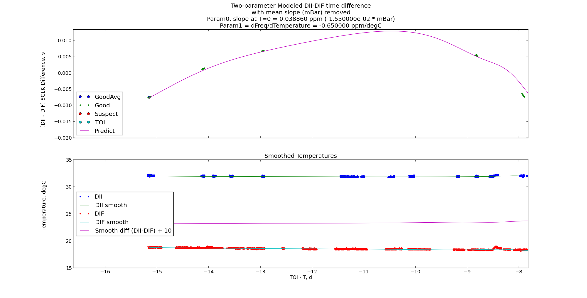

Characterization and Improvement of the SPICE Kernels from the Deep Impact Encounter with Comet Tempel 1
==================================================

Brian Carcich, Latchmoor Services LLC, working for Dr. Tony Farnham of UMd

Understanding what the DI SpaceCraft cLocKs (SCLKs) were doing
around encounter.

Background
==========

The two Deep Impact (DI) spacecraft, the DI Flyby (DIF) and DI Impactor (DII), have independent SpaceCraft cLocKs (SCLKs).  The correlations of those SCLKs with each other, and with TDT (Terrestrial Dynamical Time, linear time), have been adjusted to fix the time of the DII Time Of Impact (TOI), with comet 9P/Tempel 1 during the prime mission, at UTC 2005-07-04T05:44:34.2; that time matches the ephemeris in the final ephemeris solution provided by Dan Kubitschek (JPL Optical Navigation Group).  Based on the appearance of the impact flash in DIF images at encounter, the TOI was 173727702:218 on the DIF clock (N.B. the :218 is not milliseconds).  Based on geometric analysis by Dennis Wellnitz(University of Maryland) of the DII final encounter images, TOI was 173727875:105 on the DII clock.  With the TOI point fixed, linear interpolation to the last formal correlation point on DOY 164, three weeks earlier, models the relationship between the DI SCLKs and TDT during the approach to 9P/Tempel 1, using the SPICE SCLK kernel format.

Further background on this issue is available in the [accompanying documentation](../doc/spacecraft_clock_correlation/) [[PDF]](https://github.com/drbitboy/Sclk9P/blob/master/doc/spacecraft_clock_correlation/sclk_correlation.pdf?raw=true), extracted from the [DI mission documentation data set](http://pdssbn.astro.umd.edu/holdings/di-c-hrii_hriv_mri_its-6-doc-set-v4.0/document/flight_data/di/spacecraft_clock_correlation/) archived with the Planetary Data System (PDS).  There are also some subtleties in the interpretation of the DI SCLK counters; those subleties, as well as details of the DI SCLK internals and digital representation, will not be described here and the reader is encouraged to browse the [document directory](../doc/) that is distributed on Github as part of this report as well as the [JPL/NAIF/SPICE SCLK required reading](http://naif.jpl.nasa.gov/pub/naif/toolkit_docs/C/req/sclk.html) and associated documents.

After the end of the prime mission, limited efforts were made to improve the SCLK correlation.  Unresolved ambiguities in flight software and telemetry had limited the accuracy of the correlation to +/-1s; during the extended EPOXI mission, and an error was discovered in the way image timestamps were set.  During these efforts, Amy Walsh (Ball Aerospace) resolved many of these issues, fully characterized the DI SCLKs, and developed a method to improve the correlation accuracy by two orders of magnitude.  

Amy also provided flight thermal data for the DI SCUs (Spacecraft CPUs), vendor data describing the thermal performance of the SCLK oscillators, five other reliable time correlations within a fortnight of TOI, and one other suspect correlation a few days before TOI.  The available data are summarized in following figures (if this Readme file is being viewed on the Github website, larger versions of the images may be viewed by clicking on the images here):

__Timing data; the red and green points, and the blue line, are based on SPICE SCLK kernels (models); note that the Good, Suspect and TOI points in the inset are offset from the SCLK model and suggest a different slope__

__Thermal data; note that these temperature sensors are near, but not on, the oscillators__

At the time, the mission focus was on delivering prime data sets to PDS, so further work applying these data to improving the SCLK correlations was postponed, and later became the current project:  Characterization and Improvement of the SPICE Kernels from the Deep Impact Encounter with Comet Tempel 1.

Project Scope and Cut To The Chase
==================================

The goals of this project were 

- to determine if the additional thermal data, and later SCLK correlation data, can facilitate significantly improving our knowledge of the timing of the DI TOI, perhaps tying it back to earth-based observations, and if so, 

- to provide an updated timing model, as well as updated trajectories, in the form of SPICE SCLK- and SP-Kernels

To cut to the chase, the answer is no, the additional data do not suggest a physically plausible model consistent with the available data that will improve the timing model in such a way as to significantly improve the science obtained from the mission.

Summary
=======

The following figure combines the thermal data with the timing difference data: 

The lower plot shows the thermal data over the last two weeks before TOI.  The blue points are for DII, the red are for DIF, and the lines represent smoothed data used for interpolation.

The upper plot represents drift in differences between the DII and DIF spacecraft clocks over the same time period.  Both clocks have the same nominal starting point (the J2000 epoch, 2000-01-01T12:00:00 TDT) run within a few PPM of the same rate, 1Hz, for the most-signficant ("tick") counter, so plotting one against the other would lose the subtleties of the thermal effect on drift in the slope.  Instead, the mean drift slope (_a la_ continuum in spectroscopy) between the DII and DIF clocks has been removed to emphasize the changes over this time period.  The large large blue point on the left is the average of the first group of green good points and has been arbitrarily set to zero offset on this plot; the five groups of small green points on the left are the good points obtained by Amy; the one red point is the Suspect point; and the cyan point is the TOI derived from the DII and DIF imaging.  The line is a two-parameter model fit to the five groups of good data, then extrapolated to TOI.

Two conclusions are suggested by these plots:

- The plot makes physical sense to first order and suggests the selected temperature sensor is a reasonable analog for the oscillator temperature:  the average thermal effect on the vendor-supplied oscillators, per the [supplied documentation](../doc/SER_DI-SC-CDH-053_Oscillator_-_Vendor_Data_and_Analysis.doc), is -0.65 PPM/degC; that negative value means when the oscillator temperature decreases, the oscillator frequency increases, and vice versa; so when the DIF temperature drops at around TOI-5d while the DII temperature stays relatively constant, the [DII - DIF] difference slope decreases, consistent with the cooler DIF oscillator running faster per the negative thermal rate constant; similarly, when the DII oscillator temperature rises, then falls, between TOI-2d and TOI, the difference slope decreases, then increases, respectively.

- The good points lie almost on a (mean-slope-removed) horizontal line with the TOI point.  Since those good points lie more or less on the interpolated model between the DOY 164 correlation point and the TOI point (see the first figure in Background above), any model which has a significant excursion from the zero line should return to a point near (i.e. within the error budget of at most 200ms; see below) of the line by TOI.

It is that second point that puts the nail in the coffin of this approach.  The five groups of green good points on the left form a smooth hump, consistent with the gradual drift in temperatures over DOYs 170 to 177, as seen in the following zoomed-in section of that plot:

Any physically plausible temperature-dependent SCLK model that fits those five groups of points, whether or not it goes near the suspect point, must return to within 200ms (the error budget) of the TOI point.  Any two-parameter model with a temperature coefficient of about a half a PPM per degC (per the Vendor document) as displayed above and described below, does not come close, as the [DII - DIF] difference will decrease far more over the six days of reduced DIF temperatures and increased DII temperatures, than can be recovered in the final day when the temperatures reverse that trend.  Furthermore, there is an expected delay of the flash from the TOI of up to 200ms (see Error budget, below) which moves that TOI point up, even farther away from any reasonable model.

So any SCLK model that starts on the good points and finishes near the TOI point will have reduced the temperature coefficient to the point where the model is basically linear in time, which is essentially what we started with, and will therefore yield no significant improvement to the SCLK model.

We could impose a slope more in line with the good and TOI points than the current model, but 

- that would only show up in images far away from the TOI where timing errors are already in the noise, and

- near TOI the current model is already well within the error budget.

Discussion
==========

### Error budget, errors and other subtleties

- The uncertainty in the DIF image-derived TOI is about 30ms, half the image cadence of the MRIVIS images.  That TOI is based on the appearance of the flash in the DIF images.  Those images had an integration time of 51ms and were initiated every 60ms.  The appearance of the flash in the first "flash image" image is unambiguous.  However the flash could have begun anywhere during that image or even at or near the end of the previous image, giving an uncertainty of about 30ms from the mid-exposure time of the flash image.  Furthermore:

  - The delay between TOI and the flash has been estimated by the project co-investigators to be as much as 200ms.  That delay is asymmetric i.e. the TOI can only occur before (i.e. be _less than_), and _not_ after (i.e be greater than), the time of the flash.  So the delay does not figure into any formal uncertainty calculation, but it should be noted that its presence is a bias and it can only increase the [DII - DIF] SCLK difference i.e. move the TOI point _up_ in the plot above.

- The uncertainty in the DII image-derived TOI is about 50ms, dominated by the integration time of the final ITSVIS images (100ms).

- Some effects have been ignored as insignificant in this analysis, but are mentioned here for completeness:

  - The light-time transmission from the comet to the DIF means the actual DIF TOI is about 30ms earlier than using the DIF image timestamps directly; again, this increases the [DII - DIF] difference.

  - A anomaly was discovered during the EPOXI extended mission in the way image timestamps were processed, as described [here](../doc/sclk_fix.asc).  The net effect would be to reduce the [DII - DIF] difference by at most 20ms, essentially negating the light-time effect above.

